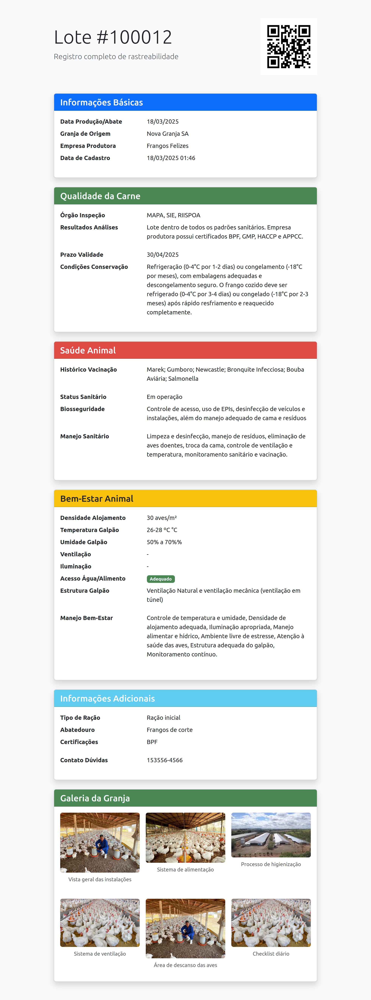
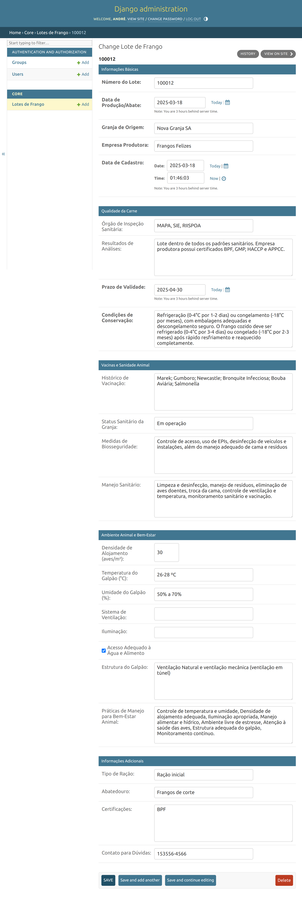

# 🐔 Rastreabilidade Agrícola - Sistema de Gerenciamento de Lotes

Sistema completo para rastreamento de lotes de frango com blockchain e QR Codes. Desenvolvido para garantir transparência na cadeia produtiva agrícola.

## ✨ Funcionalidades Principais

- **Registro Completo de Lotes**
- **Geração Automática de QR Codes**
- **Interface Responsiva** (Acesso mobile e desktop)
- **Gestão de Acesso** (CRUD completo com autenticação)
- **[Em desenvolvimento ] Integração com Blockchain** (Registro imutável)

## 🛠 Stack Tecnológica

### Backend
| Tecnologia          | Descrição                           |
|---------------------|-------------------------------------|
| Python 3.10+        | Linguagem principal                 |
| Django 5.1          | Framework web                       |
| qrcode[pil]         | Geração de QR Codes                 |
| PostgreSQL          | Banco de dados principal (produção) |
| Django REST Framework| API REST (opcional)                |

### Frontend
| Tecnologia          | Descrição                           |
|---------------------|-------------------------------------|
| Bootstrap 5         | Estilização e componentes           |
| HTML5/CSS3          | Estrutura básica                    |
| JavaScript          | Interatividade básica               |

